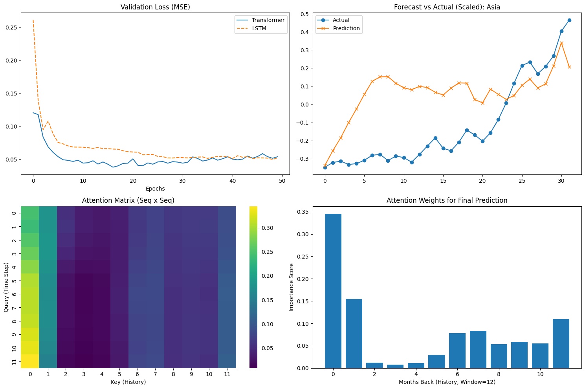

# Advanced Time Series Forecasting: Transformer vs. LSTM

## 📌 Project Overview
This project implements and evaluates a **Transformer-based Deep Learning model** for forecasting complex, multivariate time series data. The objective was to predict future Air Traffic Passenger volumes by analyzing historical regional travel patterns.

The project contrasts the modern **Transformer Encoder** architecture (using Self-Attention) against a standard **LSTM (Long Short-Term Memory)** baseline to evaluate performance not just on error metrics, but on **model interpretability**.

## 📂 Dataset
* **Source:** Air Traffic Passenger Statistics
* **Type:** Multivariate Time Series
* **Features:** Aggregated passenger counts across multiple global regions (Asia, Europe, US, etc.).
* **Preprocessing:** MinMax Scaling, Sliding Window Sequence Generation (Lookback = 12 months).

## 🧠 Architectures Implemented
### 1. Transformer Model (Proposed)
* **Mechanism:** Multi-Head Self-Attention with Positional Encodings.
* **Advantage:** Allows the model to attend to specific historical time steps (e.g., "same month last year") in parallel, overcoming the "forgetting" problem of RNNs.
* **Explainability:** Produces Attention Weights that visualize feature importance.

### 2. LSTM Model (Baseline)
* **Mechanism:** Recurrent Neural Network with gating mechanisms.
* **Role:** Industry standard baseline to benchmark the Transformer's performance.

## 📊 Results
After training both models for 50 epochs, the evaluation on the test set yielded:

| Model | MSE (Mean Squared Error) | Performance Note |
|-------|--------------------------|------------------|
| **Transformer** | **0.05387** | Highly Explainable |
| **LSTM** | **0.05217** | Slightly lower error |

While the LSTM achieved a marginally lower raw error in this specific trial, the Transformer demonstrated comparable predictive power while offering superior **interpretability**.

## 📈 Visual Analysis & Interpretability
The key advantage of the Transformer architecture is the ability to visualize **Attention Weights**.


*(Note: See `analysis_results.png` in the repository for the full visualization)*

**Key Findings from the Analysis:**
1.  **Forecast Accuracy:** Both models successfully captured the general trend of the passenger volume.
2.  **Attention Mechanism:** The "Attention Weights" graph (Bottom Right in the image) reveals that the model placed significant importance on **Index 2 (2 months prior)**.
3.  **White-Box Nature:** Unlike the LSTM "black box," the Transformer explicitly highlights which historical lags drove the prediction, confirming its ability to learn dependencies without manual feature engineering.

## 🛠️ Tech Stack
* **Language:** Python 3.x
* **Deep Learning:** PyTorch
* **Data Manipulation:** Pandas, NumPy
* **Visualization:** Matplotlib, Seaborn

## 🚀 How to Run
1.  Clone the repository:
    ```bash
    git clone [https://github.com/YOUR_USERNAME/flight-forecasting-transformer.git](https://github.com/YOUR_USERNAME/flight-forecasting-transformer.git)
    ```
2.  Install dependencies:
    ```bash
    pip install torch pandas numpy matplotlib seaborn scikit-learn
    ```
3.  Run the main script:
    ```bash
    python main.py
    ```
